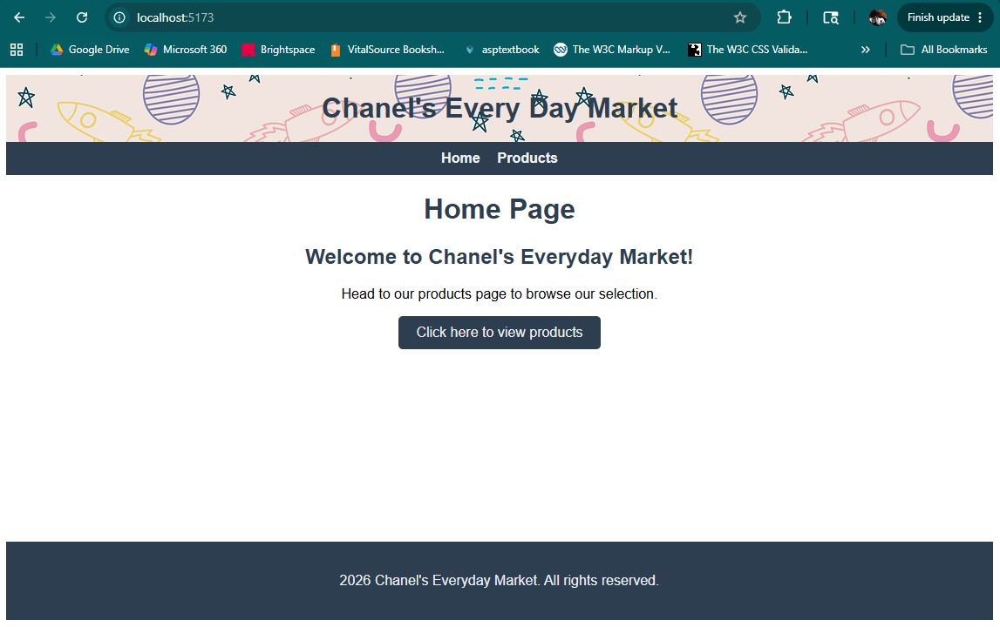
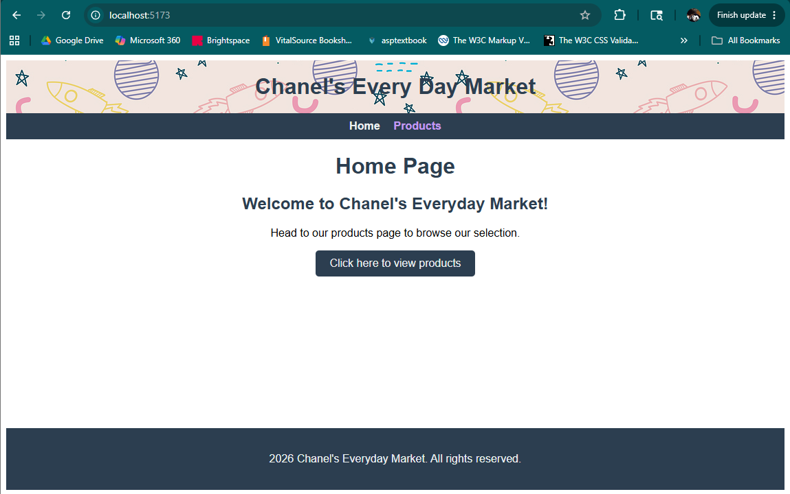
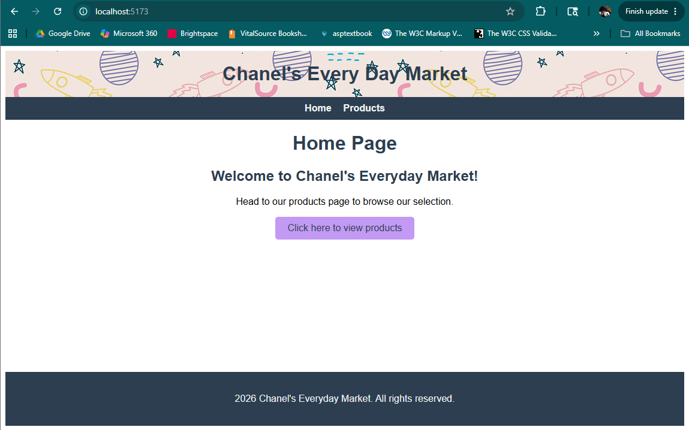
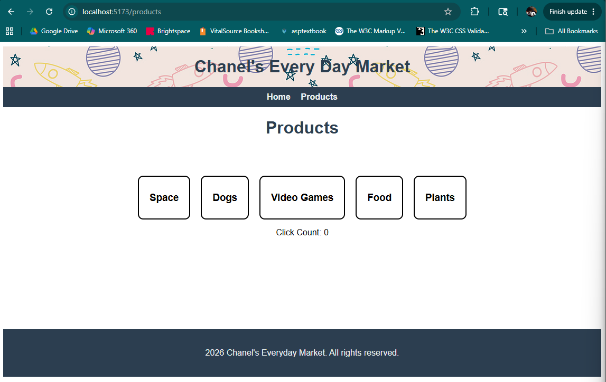
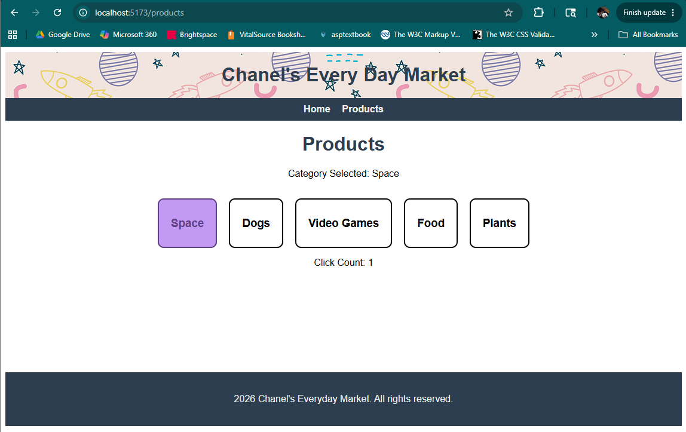

# Module 2 Assignment: Everyday Market App - React
by Chanel Cannon
completed May 23, 2026

This project was generated using the Vite React template.

This project was created using the help of GitHub Copilot AI Assistant.

Space pattern found at: [https://pixabay.com/vectors/space-astronomy-spaceships-5654794/](https://pixabay.com/vectors/space-astronomy-spaceships-5654794/)

## Introduction
Rebuilding the "Everyday Market App" application using React and Vite to show use of React framework, use of reusable components using hooks, data binding, management of state and props, and coordinationof components interaction using props and callbacks.

## Table of Contents
- [Requirements]
- [How it Works]
  - [Parent Product Page - Child Category Menu]
  - [Parent Category Menu - Child Category Menu Item]
- [Testing]
	- [Development Server]
  - [Build]
  - [Preview]
  - [Home Page]
  - [Products Page]
- [References]
- [Auto-generated README info from React + Vite]
  - [React + Vite]
  - [React Compiler]
  - [Expanding the ESLint configuration]

## Requirements
- Node.js
- an IDE (I used Visual Studio Code) with integrated terminal

## How it Works
The application has a global component `Header` with a background image and a navbar, and two page components, `Home` and `Products Page`. There is also a global `Footer` with simple text.

On the `Products Page` page, the focus of this assignment, you will see five categories. These are the `Category Menu Items` components which are bound to the overall `Category Menu`, which is bound to the `Products Page`.

The `marketService` service provides the array of categories and a function to load the categories array to the `Products Page`.

*****ADD STUFF HERE


## Testing
### Development Server
To start a local development server, run:

```bash
npm run dev
```

Once the server is running, open your browser and navigate to `http://localhost:5173/`.

### Build
Create a production build
```bash
npm run build
```

### Preview
Serve the production build locally for previewing
```bash
npm run preview
```

### Home Page
Once you have navigated to the local server, the application will load the `Home` page:



From here, there are two options that Route via Link to the `Products Page` page, via the Nav Bar:



Or via a button I decided to add for UI (and for fun!):



### Products Page
Once you have navigated to the `Products Page` page, it will load as shown here: 
- Note 1: There is a intentional 2 second delay to simulate loading time.
- Note 2: I have included a click counter so that I could visibly ensure communication from child `Category Menu Item` up to grandparent `Products Page`.



You can then test the Event tracking by parent `Category Menu` of child `Category Menu Item` by clicking on a category box (a `Category Menu Item` component) and seeing that `Category Menu` creates a notification of which category box was clicked:
- Note: See the notification showing communication between child `Category Menu Item` and parent `Category Menu` as well as the click counter increase showing communication from child `Category Menu Item` up to grandparent `Products Page`.



## References
I referenced the instructions from Module 2 Practice Activities 1, 2, and 3.

## Auto-generated README info from React + Vite
### React + Vite
This template provides a minimal setup to get React working in Vite with HMR and some ESLint rules.

Currently, two official plugins are available:

- [@vitejs/plugin-react](https://github.com/vitejs/vite-plugin-react/blob/main/packages/plugin-react) uses [Oxc](https://oxc.rs)
- [@vitejs/plugin-react-swc](https://github.com/vitejs/vite-plugin-react/blob/main/packages/plugin-react-swc) uses [SWC](https://swc.rs/)

### React Compiler
The React Compiler is not enabled on this template because of its impact on dev & build performances. To add it, see [this documentation](https://react.dev/learn/react-compiler/installation).

### Expanding the ESLint configuration
If you are developing a production application, we recommend using TypeScript with type-aware lint rules enabled. Check out the [TS template](https://github.com/vitejs/vite/tree/main/packages/create-vite/template-react-ts) for information on how to integrate TypeScript and [`typescript-eslint`](https://typescript-eslint.io) in your project.
